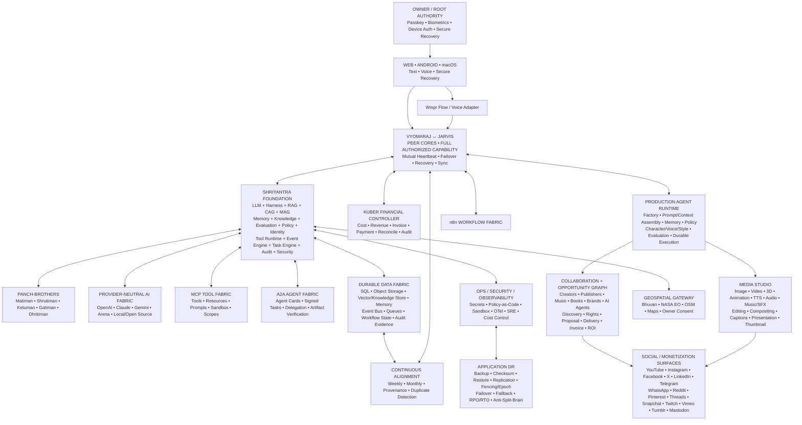

# VYOMARAJ AI AGENT OS — FINAL MASTER ARCHITECTURE v1.5
**Identity:** VYOMARAJ-AI-STUDIO | **Brand:** Vyomaraj — The King of the Sky

## Architecture lock
Vyomaraj/Bharath and Jarvis/Laxman are peer cores with full authorized capability, mutual backup, mutual recovery and shared state. The owner is the only root authority. Voice is an interface, never the sole root.

## Diagram

## End-to-end autonomous loop
INTENT → AUTHENTICATE → AUTHORIZE → DEFINE → INVENTORY → RESEARCH → PLAN → POLICY/RISK → KUBER COST CHECK → SELECT AGENT/CHARACTER/VOICE/TOOLS → BUILD CONTEXT/PROMPT → EXECUTE → EDIT/VERIFY → RIGHTS/SAFETY/FACT QA → PUBLISH GATE → PUBLISH → ANALYZE → EARN → KUBER RECONCILE → LEARN → IMPROVE.

## Voice identity
Vyomaraj = **True Leader / Legend**: deep, regal, warm, composed, charismatic, cinematic Indian male voice.
Jarvis = **General in Command**: strong, disciplined, alert, tactical, responsive Indian male voice.
Both are original synthetic identities. Actor-inspired characteristics may be used only as broad attributes; no actor-name prompting, voice cloning, voiceprint imitation or unauthorized recordings.

Voice modes inherit by domain: Education soft/calm/engaging; Bhakti respectful/culturally grounded; War strong/historical; Science precise; Business crisp; Emergency decisive.

## Creative autonomy
The creative director selects character, wardrobe, visual style, voice mode, language, format, editing and toolchain within policy. Weekly wardrobe rotation and visual cleanliness are continuity/production tasks, not identity changes.

## Knowledge and civilization
Every agent inherits origin → history → present → trends → future with provenance/evidence labels. Education is the universal civilization/knowledge spine; Bhakti and special domains cross-link rather than isolate knowledge.

## Revenue and collaboration
Every opportunity/content item can trace content → agent → process → platform → expected revenue → reported revenue → invoice/receivable → payment → Kuber reconciliation → audit. No fake engagement, spam, rights violations or platform-policy bypass.

## Security and recovery
Owner-only root, least privilege, server-side secrets, step-up approval for high-risk actions, policy-as-code, sandboxed tools, immutable audit evidence, signed A2A tasks, deny-by-default MCP discovery, split-brain fencing/epoch, application-level DR. Git replication alone is never considered application DR.

## Deployment truth
This architecture is implementation-ready, but external provider/account credentials, production infrastructure and third-party authorizations are runtime dependencies. The integration script must fail closed and report them as NOT_CONNECTED/NOT_VERIFIED rather than fabricate success.
