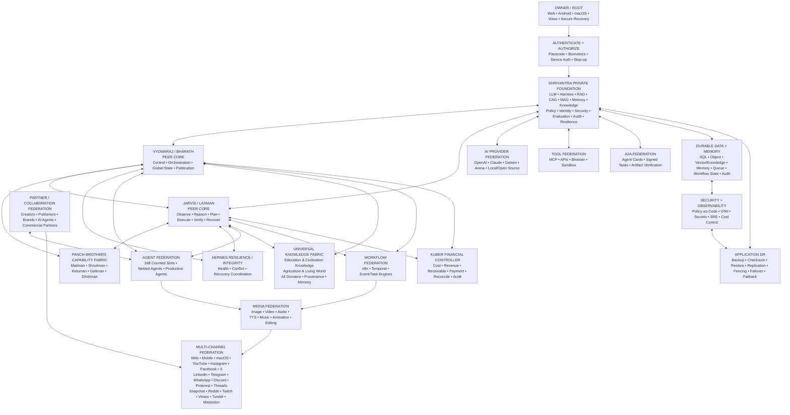

# VYOMARAJ FINAL SYSTEM DIAGRAM v2.0

### Authority boundary
OWNER > SHRIYANTRA > PEER CORES > HARNESS/POLICY > FEDERATED CAPABILITIES > VERIFICATION/AUDIT > RECOVERY.

No provider, partner, agent, tool, workflow, channel or media service can move above that boundary.
