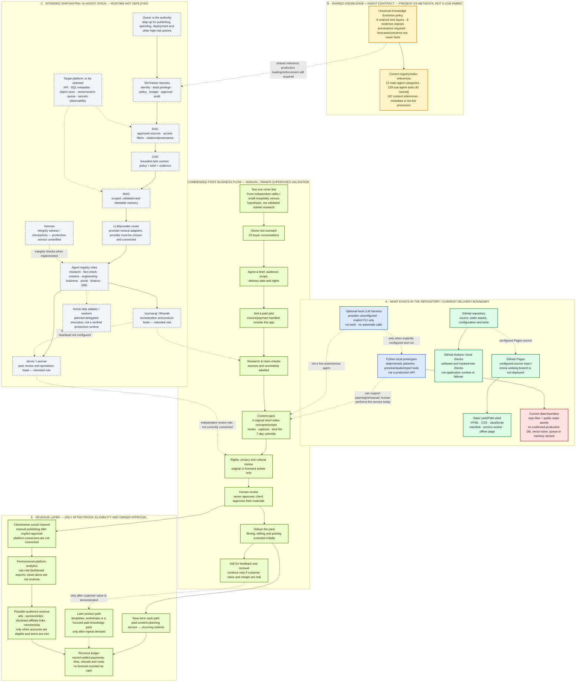

# Vyomaraj + Jarvis — Technology, AI-Agent & Revenue Flow

**Status:** strategy and architecture proposal, based on the repository inspected on 7 October 2026. This is not a claim that the AI agents, integrations, payment system, or revenue are live. The solid/current section describes repository artifacts and configured hosting; dashed paths are proposed or unverified.

## Single-view flow chart

**Reading the chart:** The revenue workflow is an operating recommendation, not an automated feature. Today the viable path is the owner using existing local planning/research tools and delivering work manually. Do not represent the registry, local LLM harness, RAG/CAG/MAG configuration, peer link, or publishing/payment adapters as live agents or connected services.

## Technology and agent map

| Layer | Technology / roles in the repository | Honest status |
|---|---|---|
| Web surface | HTML, CSS, JavaScript, Web App Manifest, service worker, offline page; GitHub Pages | Static preview/site artifacts exist. Pages metadata points at `main:/`; this Arena branch is not deployed. It is not the private AI control plane or a customer checkout. |
| Local product prototypes | Python planners, local preview/studio/report tools, browser prototypes | Useful for rehearsals and deterministic planning. Not a hardened public service; no automatic publishing or customer intake/payment flow. |
| Build and assurance | Git, GitHub Actions, Python test suites, browser checks, read-only probes | Can verify source/config and tests. A matching Git tree is not production DR, a running app, or revenue evidence. |
| Optional model call | Provider-neutral OpenAI-compatible HTTP harness with `vyomaraj` and `jarvis` role profiles | Provider is unconfigured; use is explicit/local; no tools or automatic execution. Review a provider's privacy terms before sending customer briefs. |
| Shared policy | ShriYantra policy reference; Universal Knowledge Evolution inheritance; provenance and future-claim guard | Policy/config and offline validation exist. `reference_contract_not_deployed`: no proof of production enforcement. |
| Retrieval and memory | RAG, CAG, MAG, model routing, Harness, Hermes and Arena adapter | Target/configuration contracts only; not a verified deployed runtime, shared memory service, or peer mesh. |
| Native/mobile | PWA assets; a tracked APK artifact | APK signing, source provenance and device installation are unverified. No native Android build source or macOS/Xcode project was found. |
| Commercial integrations | Model vendors, social APIs, analytics, payment, affiliate and sponsor connections | Not connected/verified in this repository. The platform registry is not account authorization. |

### Agent family responsibilities

These are registry roles, not a report of processes currently running. Bharath/Vyomaraj is the intended orchestration head; Laxman/Jarvis is a peer head for review/operations. They do not have a verified authenticated production peer connection.

| Registry family | Example roles in the registry | Use in the proposed earning workflow |
|---|---|---|
| Core | Orchestrator, research, web research, fact-check, architecture, project manager, final review | Convert an approved customer brief into a scoped plan; check claims and deliverables. |
| AI | OpenAI, Claude, Gemini, local model, model router, prompt governance | Optional drafting/routing only after an owner selects and configures a provider; currently no provider is configured. |
| Engineering | Coding, GitHub, debug, DevOps, QA, security | Build and test product plumbing after demand is proven; do not expose internal credentials or auto-deploy. |
| Creative | Content, creative, script, image, audio, video, media | Draft original concepts and scripts now; image/video/audio generation adapters are not configured. |
| Social | YouTube strategy/research/script/SEO, thumbnail, shorts, analytics, monetization, publisher | Prepare channel-specific drafts and analyze permissioned metrics; platform publishing/analytics connections remain unconfigured. |
| Knowledge | Data, memory, knowledge, analytics, RAG, CAG, MAG | Maintain source notes and evidence labels; retrieval and shared memory services are not deployed. |
| Business | Marketing, sales, product, business, automation | Qualify leads, define the offer, follow up and measure renewal; owner-led/manual first. |
| Resilience | Health monitor, SRE, self-healing, DR, failover, backup, restore, conflict resolution | Protect internal service reliability; do not market a configured recovery plan as proven production resilience. |

## Recommended earning strategy

### Start with a service, not ad forecasts

**First offer to test:** a small, clearly scoped short-form content pack for independent cafés or small hospitality businesses in Pune. The repository has FOOD/Tourism planning material, but no customer demand has yet been validated.

A pilot could include **four original content concepts/scripts**, hook, caption/CTA, shot list, one-week calendar, sources/claim notes, a rights checklist and one revision. Exclude filming, video generation, paid media, posting, and promises of reach or sales until those capabilities and permissions actually exist.

The price bands below are **experiments, not researched market rates or earnings promises**: test a one-week pilot around **₹2,500–₹5,000**, then consider a **₹8,000–₹18,000/month** planning retainer only if customers renew and the time/cost math works. Interview potential buyers before fixing prices; change scope or price if they will not pay.

### Revenue ladder

1. **Paid pilot service:** collect for a defined deliverable using an owner-selected, lawful invoicing/payment method outside this application. No payment gateway is connected here.
2. **Recurring service:** turn successful pilots into a monthly planning/review retainer; report actual deliverables, revisions, hours and customer feedback.
3. **Digital products/workshops:** only after repeated requests reveal a specific reusable need; validate with preorders or a small paid cohort.
4. **Audience revenue:** later, and separately: platform ads, memberships, sponsorships or affiliate commissions. Require verified account ownership, eligibility, written terms where needed, clear disclosures and actual settlement reports. Reposting a clip does not automatically multiply revenue.

### Four-day validation sprint: 7–11 October 2026

- **7 Oct:** choose the café/hospitality hypothesis; create three original sample packs, labelled as samples—not client results. Finalize exclusions, rights checklist and owner review.
- **8–9 Oct:** speak with ten potential buyers. Ask what content work they already pay for, the outcome they need, approval workflow and budget. Seek three paid pilot commitments; do not build integrations first.
- **10 Oct:** deliver the first pilot manually. Track time, revisions, client approval and any attributable enquiry/coupon result, with the client's permission.
- **11 Oct:** continue, re-scope or stop based on actual conversion, renewal interest and contribution margin. A target date is not proof of launch, deployment or market fit.

### Measure money honestly

`Net contribution = cash actually collected − refunds − payment/platform fees − direct production/tool/contractor costs − tax reserve.`

Track qualified conversations, paid-pilot conversion, delivery hours, revision count, renewals and customer-attributed outcomes. Keep views, likes and forecasts in a separate engagement report. **Do not use the legacy `₹340 CPM` or “triple revenue on three platforms” calculations as actual or promised income**: they are unsupported assumptions, not verified payouts. Views × an assumed CPM is not a revenue ledger.

## Required guardrails

- Owner approval remains mandatory before public posting, spending, deploying, changing account access or connecting customer data. Agents cannot inherit root-owner authority.
- Use only original or properly licensed media. A “fair use” label by itself does not grant reuse rights. Keep source and licence records.
- For cultural, devotional or educational material, distinguish tradition/belief from sourced historical fact; do not promise cures, blessings, investment gains or guaranteed outcomes. Label forecasts and scenarios as uncertain.
- Collect only the customer information needed to deliver the agreed work; get permission before using customer metrics or examples in a portfolio.
- Never place provider keys, payment credentials, bank data or customer personal data in the repository, prompts, or chat.

## Repository evidence to consult

- `config/agents/shriyantra-agent-registry.json` — shared service and agent-family role metadata.
- `config/intelligence/shriyantra-rag-cag-mag.yaml` and `config/knowledge/UNIVERSAL_KNOWLEDGE_EVOLUTION_INHERITANCE_V1.json` — shared knowledge/control contracts and deployment status.
- `ops/jarvis/LLM_HARNESS.md` — provider-unconfigured, explicit no-tools harness.
- `ops/vyomaraj-core/experience/EXPERIENCE_ORCHESTRATOR.json` — plan-only routes, local adapters and owner-review gates.
- `ops/bhakti-shakti/revenue-reel-system.json` — preserved historical concepts; its account, CPM, audience and revenue claims are not verified and must not be repeated as facts.
- `ops/vyomaraj-core/handover/GO_LIVE_GAPS_AND_PLATFORM_2026_10_06.md` — current release and integration gaps.
