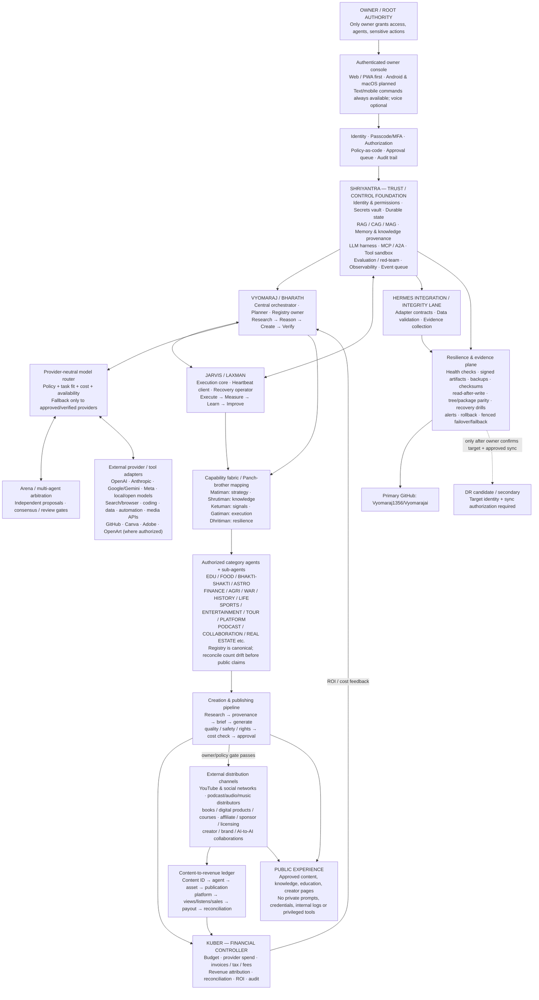

# Vyomaraj — Market-launch architecture and capability map
**Snapshot date:** 9 October 2026  
**Branch:** `launch/2026-10-09-architecture-and-market-readiness`  
**Purpose:** one source of truth for the intended internal/external architecture, capability inheritance, monetization path, and launch gates.

> **Evidence rule:** This is the target architecture and an implementation/readiness map, not a claim that every named service is connected, deployed, or production-tested. The current repository release audit explicitly says production alignment, live peer heartbeat, native Android/macOS readiness, and production DR are not proven. Keep issue #6 OPEN/P0 until its acceptance evidence exists.

## 1. Architecture diagram



## 2. Internal vs external boundary

### Internal / private control plane
- Owner-root authority; identity, access policy, approvals and revocation.
- Vyomaraj/Bharath orchestrator and Jarvis/Laxman executor/peer role. Neither peer can self-grant root.
- ShriYantra shared foundation: model harness/router, memory, knowledge provenance, MCP/A2A tools, policy, durable execution, event queue, evaluation, security, logs and recovery.
- Hermes adapter/integrity lane; capability registry and agent/sub-agent lifecycle.
- Kuber financial controller and private ledger: cost, income, receivables/payables, fees, taxes, refunds, ROI and reconciliation.
- Secrets, private source data, prompts, operational logs, recovery credentials and owner approvals stay private.

### External / adapter boundary
- AI/model providers: OpenAI, Anthropic, Google/Gemini, Meta and approved local/open models.
- Specialist tools: Arena AI, search/browser, coding, data, automation, GitHub and media creation/editing tools.
- Distribution: YouTube/social networks, podcasts/audio/music services, books/publishing, courses, digital products, sponsorship, affiliate, licensing/syndication and creator/brand collaborations.
- Each integration must be individually labelled **planned → credentials configured → connected → integrated → tested → monitored**. A provider/tool being named here is not proof it is connected or commercially eligible.

## 3. Universal execution contract

```text
INTENT → AUTHENTICATE → AUTHORIZE → DEFINE → INVENTORY → RESEARCH
→ PLAN → RISK / POLICY → KUBER COST CHECK → OWNER / POLICY APPROVAL
→ EXECUTE → VERIFY → RECONCILE → AUDIT → MEASURE → REPORT
→ LEARN → IMPROVE → CLOSE OR CONTINUE
```

For media, include rights/provenance, factual and cultural review, platform format checks, accessibility, brand consistency, owner/publishing policy and post-publication performance measurement. Never allow automatic public publishing merely because content generation succeeded.

## 4. Content and monetization traceability

```text
CONTENT-ID → AGENT-ID → SUB-AGENT-ID → TOPIC-ID → CREATION COST
→ ASSET / PRODUCT-ID → OWNER APPROVAL → PUBLICATION-ID → PLATFORM
→ PERFORMANCE → EXPECTED / REPORTED REVENUE → INVOICE / PAYOUT
→ KUBER RECONCILIATION → AUDIT CLOSURE → LEARNING
```

Revenue lanes to validate individually: YouTube monetization, memberships, sponsorships and affiliates; social-platform creator programs; podcast/audio distribution; music distribution/royalties; books and literature; courses and digital products; licensing/syndication; creator/brand partnerships; and AI-to-AI services. Eligibility, geography, audience thresholds, platform terms and payout setup differ. Do not forecast revenue as guaranteed.

## 5. Current verified readiness — not to be confused with the target diagram

| Surface | Evidence-based state as of the repository records |
|---|---|
| Primary repository | Private primary is `Vyomaraj1356/Vyomarajai`; this change is on a review branch, not main. |
| DR | README evidence dated 8 Oct reports `tree=MISMATCH`, `packages=MISMATCH`: 135 files missing, 105 changed; of 54 package files, 4 missing and 5 different. No sync write was performed by the diagnostic probe. |
| DR authority | Effective target identity, owner/admin confirmation, target-only-data review and sync authorization remain gates. Never force-overwrite or invent the target. |
| Scheduled verification | README says the main-branch verification pipeline was blocked by failing offline tests; this branch contains repairs but they are not live on main until reviewed/merged. |
| Web/PWA | Static public shell exists in repository; current branch is not deployed. A local deterministic preview is not production or an autonomous AI service. |
| Android/macOS | No Android or Xcode native source/build project was evidenced in the release audit. A tracked APK/signing-block observation is not signature or device-install verification. |
| Live Vyomaraj↔Jarvis heartbeat | Not verified: peer endpoint URLs are blank; no authenticated production peer service, scheduler, alerting, quorum or failover is evidenced. |
| AI providers and external services | Adapter names are architecture candidates only. Per-provider credentials, permissions, connectivity, integration tests and monitoring must be recorded separately. |
| Automatic publishing | Keep disabled until policy, rights/safety, owner approval and platform-specific credentials/eligibility are verified. |
| Kuber | Treat as the intended financial control plane; production ledger feeds, payout connections and reconciliation tests must be evidenced before financial claims. |

Source records: `README.md`; `docs/architecture/VYOMARAJ_ARCHITECTURE_AND_PUBLISH_v1.2.md`; `ops/vyomaraj-core/handover/INTEGRATION_ALIGNMENT_AND_RELEASE_AUDIT_2026_10_07.md`; `ops/dr/DR_SYNC_AND_PACKAGE_PARITY_2026_10_08.md`.

## 6. Two-day market launch: safe release cut

**Recommended public promise:** “Vyomaraj — The King of the Sky: a curated AI-powered knowledge and content studio,” not “fully autonomous 24×7 multi-agent OS” until runtime, provider, security, native app and DR claims are independently verified.

1. **Public surface:** deploy only a reviewed landing/PWA shell and approved showcase content. Keep private control-plane routes and all privileged writers off public ingress.
2. **Content launch:** prepare a small curated batch with content IDs, source/provenance, human/owner review, rights checks, platform-sized exports and clear calls to action.
3. **Revenue launch:** start with channels for which the owner already has eligibility and payout configuration; track every asset and cost through Kuber. Mark other lanes “coming next” until enabled.
4. **Release gates:** main branch tests pass; preview URL and production URL are independently checked; privacy/security review passes; owner confirms copy and publishing permissions; rollback is rehearsed.
5. **P0 DR gate:** keep issue #6 open until the owner confirms the canonical secondary, reviews target-only data, approves the exact sync, and evidence proves primary/DR tree and package parity plus read-after-write and recovery. Do not represent DR as ready before then.
6. **Native clients:** announce Android/macOS as planned or beta only if the actual signed builds and device/install checks are available. Do not present the tracked APK as verified.

## 7. Required status vocabulary for every integration

- **PLANNED** — design or adapter contract exists.
- **CONFIGURED** — owner-authorized credentials and settings are present in secret storage.
- **CONNECTED** — authenticated health check succeeds.
- **INTEGRATED** — end-to-end task works through the actual system.
- **TESTED** — acceptance tests and failure cases pass with evidence.
- **MONITORED** — alerts, quotas, spend, freshness and ownership are monitored.
- **PRODUCTION** — owner-approved release, rollback, security and operational acceptance are complete.

No single status should be inferred from a logo, package, repository file, generated asset, or a successful isolated API call.
