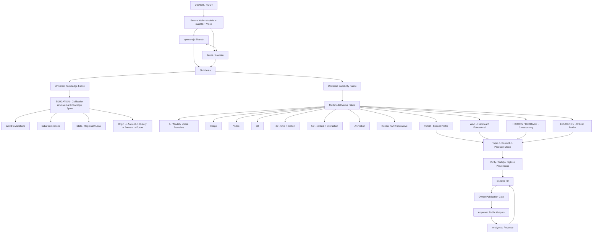

# VYOMARAJ — UNIVERSAL KNOWLEDGE + CIVILIZATION + MEDIA ARCHITECTURE v1.0

## Architecture diagram



## 1. Core inheritance

All authorized agents inherit the common multimodal capability contract through ShriYantra. Food, Education, War and historical/civilization content receive enhanced 3D/4D/5D visualization, animation, reconstruction and interactive-storytelling profiles.

Education is the **civilization and universal-knowledge spine**. It organizes shared learning/reference knowledge while specialist categories retain ownership of their own domain content. Cross-links prevent duplication.

## 2. Civilization scope

Education routes knowledge through:

**World -> India -> State/Region -> District/City/Town/Village -> Community/Local heritage**

and:

**Origin -> Ancient -> Classical -> Medieval -> Early Modern -> Modern -> Contemporary -> Current -> Trends -> Future Scenarios**

Coverage includes archaeology, languages, literature, belief systems, philosophy, governance, law, economy, trade, science, agriculture, food, architecture, art, music, clothing, education, military history, people, migration and heritage.

This is a target knowledge scope, not a claim that every external encyclopedia, wiki, archive or database is already connected.

## 3. Special media profiles

### Food
Historical kitchens, ingredients, agriculture-to-table systems, culinary tools, regional cuisines, festivals and food science can become spatial scenes, process animations, timelines and interactive experiences.

### Education
Ancient cities, monuments, archaeological sites, manuscripts, scientific models, maps, historical timelines, classrooms and civilizational reconstructions receive the full media capability stack.

### War
Historical and educational content can use maps, timelines, museum-style reconstructions and non-operational simulations. The safety boundary is enforced by policy.

### History / Heritage
History is a cross-cutting lens rather than an invented duplicate top-level category. Historical content remains with its owning domain and links to Education for civilization/learning context.

## 4. AI / Meta / provider-neutral

The media fabric has adapter slots for OpenAI, Anthropic, Google, Meta AI, Arena AI, local/open-source models and specialist media APIs.

Provider connectivity is **not** claimed by this architecture document. A provider becomes CONFIGURED/VERIFIED only after endpoint, credentials, rights, sandbox, evaluation and runtime evidence exist.

## 5. Creation pipeline

```
INTENT
-> OWNER AUTHENTICATE
-> KNOWLEDGE RETRIEVE
-> PROVENANCE VERIFY
-> SCENE PLAN
-> MEDIA GENERATE
-> ANIMATE
-> RENDER
-> QUALITY CHECK
-> SAFETY + RIGHTS CHECK
-> KUBER COST EVENT
-> OWNER PUBLISH GATE
-> PUBLISH
-> MEASURE
-> KUBER RECONCILE
-> ARCHIVE PROVENANCE
```

## 6. 3D / 4D / 5D

- **3D:** spatial objects, people, places, maps and environments.
- **4D:** 3D plus time, motion, sequence and change.
- **5D:** 4D plus contextual and interactive dimensions such as provenance, scenarios, user perspective and linked knowledge.

These are Vyomaraj experience-design labels, not claims about additional physical dimensions.

## 7. Runtime boundary

Current repository work can validate the inheritance contract and generate execution plans. It does not by itself prove a live renderer, animation provider, AR engine or external AI provider is deployed.

Runtime VERIFIED requires adapter implementation, secure credentials, sandboxing, rights/licensing controls, safety tests, output evaluation, smoke tests and owner-visible audit evidence.

## Autonomous Creative Director + Production Agent Layer

Vyomaraj/Jarvis select approved characters, voices, tones, media formats and toolchains autonomously within policy. Character, voice and visual continuity is maintained through versioned creative bibles. New providers, paid tools, voice cloning, real-person likeness and other high-risk changes require Owner/step-up approval.

Production contracts:
- config/ai/CREATIVE_AUTONOMY_AND_IDENTITY_POLICY_v1.0.yaml
- config/ai/PRODUCTION_AGENT_TOOL_REGISTRY_v1.0.yaml
- config/ai/CREATIVE_CHARACTER_VOICE_REGISTRY_v1.0.yaml
- docs/architecture/VYOMARAJ_MCP_A2A_PRODUCTION_AGENT_BLUEPRINT_v1.0.md
- ops/vyomaraj/production_agent_gate.py

MCP is the tool/resource/prompt integration layer; A2A is the agent-to-agent collaboration layer. Repository dependencies and contracts exist, but live MCP servers, A2A endpoints and media providers require runtime deployment and credentials before they can be marked VERIFIED.
