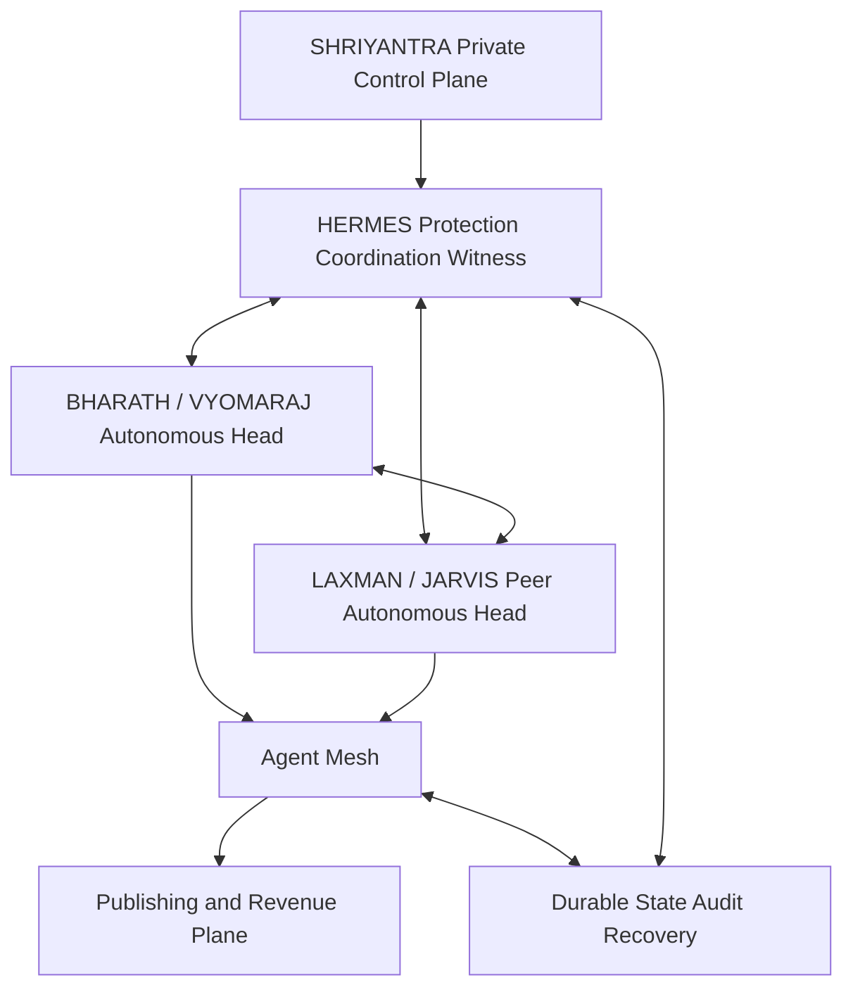

# Bharath Laxman Hermes Architecture

Bharath (Vyomaraj) and Laxman (Jarvis) are peer autonomous heads. Hermes is the coordination, integrity, recovery and audit layer. Shriyantra is the private control-plane home.

Operating loop: RESEARCH -> REASON -> CREATE -> VERIFY -> PUBLISH -> MEASURE -> EARN -> LEARN -> PROTECT -> RECOVER

Safety contract:
- preserve acknowledged valid state on both heads
- fence a failed head before promotion
- never use blind destructive overwrite
- quarantine conflicting state and reconcile by version/event lineage
- keep secrets outside replicated business state
- audit every state transition
- verify integrity before failover and failback

The existing GitHub DR mirror remains a recovery layer. Repository-level Laxman automation must not be activated until the exact Laxman/Jarvis repository is supplied.
